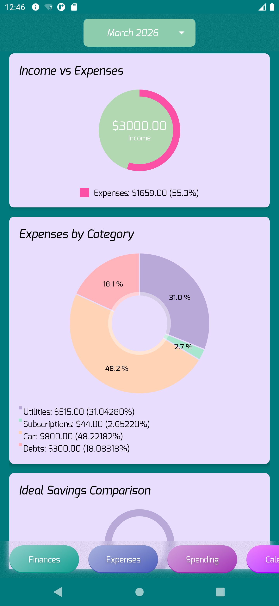
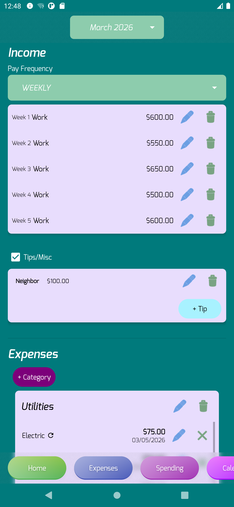
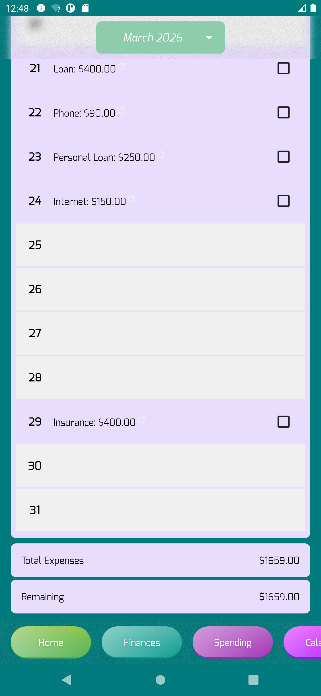
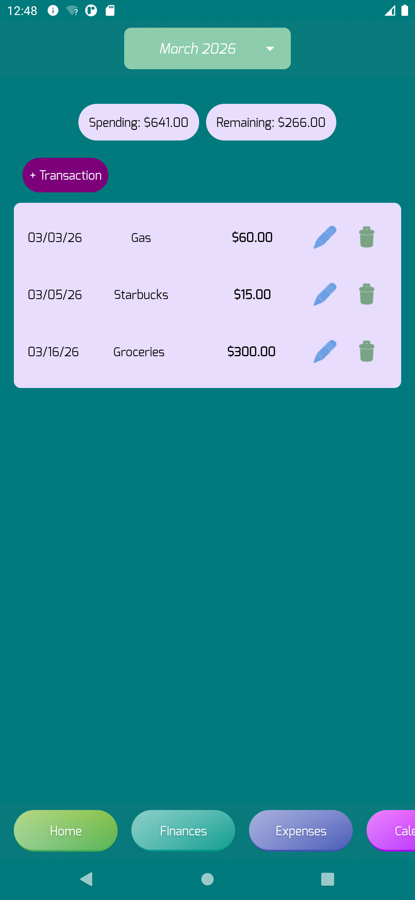
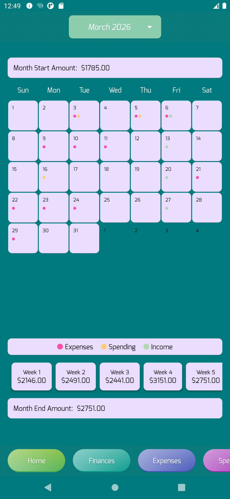
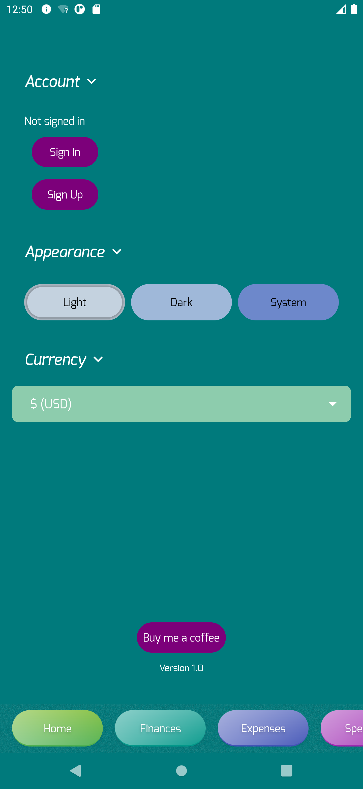
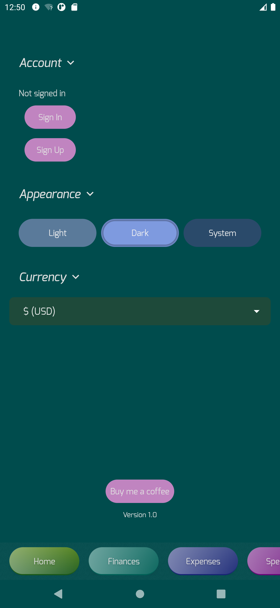
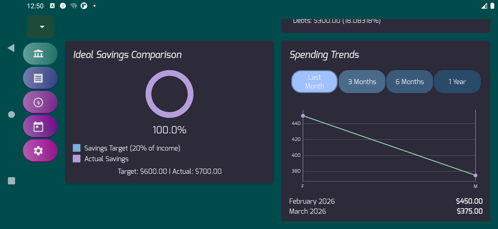

  
  <h1 style="color: #007A7C; border-bottom: 2px solid #8DCCAD; padding-bottom: 10px; display: inline-block;">Budget Brewer</h1>
  
<em>Your companion to fast‑track your way to financial freedom</em>

  

    ⭐ <strong>100% free</strong> · No ads · No subscriptions · Open source
  

  

    
    
    
    
  

---

## 💡 Philosophy & Why I Built It

  

    <strong>“Your finances truly are not something you can set and forget.”</strong>
  

  

    I was frustrated with mainstream budgeting apps – delayed bank sync, miscategorized transactions, and features locked behind paywalls. I spent more time correcting those apps than actually managing my money. After years of perfecting a custom spreadsheet, I realized others could benefit from the same hands‑on approach without the complexity of spreadsheets. Budget Brewer was born to give you <strong>control</strong>, not automation, and to help you understand your cash flow down to the last penny.
  

---

## ✅ What It Is · ❌ What It Isn't

<table style="width:100%; border-collapse: collapse; margin: 20px 0;">
  <tr>
    <td style="width:50%; background: #007A7C; color: white; padding: 15px; border-radius: 15px 0 0 15px;">
      <h3 style="color: white; margin-top:0;">✓ What It Is</h3>
      <ul style="list-style-type: none; padding-left:0;">
        <li>✔ Hands‑on zero‑dollar budgeting</li>
        <li>✔ Custom expense categories (up to 20)</li>
        <li>✔ Recurring expenses with auto‑rollover</li>
        <li>✔ Spending tracker without micro‑budgets</li>
        <li>✔ Calendar view with income assignment</li>
        <li>✔ Charts: Income vs Expenses, category breakdown, savings comparison, spending trends</li>
        <li>✔ PIN / biometric privacy lock</li>
        <li>✔ Data export (CSV/PDF) & optional cloud sync</li>
        <li>✔ Tablet‑optimized layouts</li>
      </ul>
    </td>
    <td style="width:50%; background: #5E3A7C; color: white; padding: 15px; border-radius: 0 15px 15px 0;">
      <h3 style="color: white; margin-top:0;">✗ What It Isn't</h3>
      <ul style="list-style-type: none; padding-left:0;">
        <li>✘ No bank syncing (ever)</li>
        <li>✘ No micro‑budgets (no “groceries” caps)</li>
        <li>✘ No ads</li>
        <li>✘ No subscriptions or paywalls</li>
        <li>✘ No account required (optional for sync)</li>
      </ul>
    </td>
  </tr>
</table>

---

## ✨ Feature Highlights

  

    📂 
    <strong>Custom Categories</strong>
  

  

    📊 
    <strong>Financial Snapshots</strong>
  

  

    🔄 
    <strong>Recurring Expenses</strong>
  

  

    💸 
    <strong>Spending Tracker</strong>
  

  

    📅 
    <strong>Calendar View</strong>
  

  

    🔒 
    <strong>PIN / Biometric Lock</strong>
  

  

    📤 
    <strong>Data Export</strong>
  

  

    ☁️ 
    <strong>Cloud Sync</strong>
  

  

    📱 
    <strong>Tablet Optimized</strong>
  

---

## 📖 User Guide

<strong>📊 Home Page</strong>

 

  
The Home page gives you a bird’s‑eye view of your finances with four interactive charts:

  <ul>
    <li><strong>Income vs Expenses</strong> – See your monthly income and total expenses as a percentage.</li>
    <li><strong>Expenses by Category</strong> – A donut chart showing how your expenses break down.</li>
    <li><strong>Savings Comparison</strong> – Compares your allocated savings to the 20% target (50/30/20 model).</li>
    <li><strong>Spending Trends</strong> – A line chart showing monthly spending over time; use the buttons to toggle between 1, 3, 6, and 12 months.</li>
  </ul>
  
<em>This page is read‑only – just observe and navigate.</em>

<strong>💰 Finances Page</strong>

 

  
This is the heart of Budget Brewer, where you enter income and expenses.

  <ul>
    <li><strong>Income Section:</strong> Choose your pay frequency (Weekly, Bi‑weekly, Monthly) and add income sources. Changing frequency will delete existing incomes (except tips). You can edit or delete any entry.</li>
    <li><strong>Tips/Misc:</strong> A separate section for irregular income. Check the box to enable; unchecking it removes all tips (with confirmation).</li>
    <li><strong>Categories:</strong> Create up to 20 custom categories. They appear as horizontally scrolling cards (grid on tablets). Tap a category to add, edit, or delete expenses within it.</li>
    <li><strong>Expenses per Category:</strong> Add up to 20 expenses per category. Each expense can be recurring (same day monthly or every X days). You can scroll vertically inside a category to see all its expenses.</li>
    <li><strong>Leftover Funds:</strong> After entering all income and expenses, you’ll see how much is left. Allocate it to Savings, Spending, or both. You can edit or delete allocations later.</li>
  </ul>
  
<em>💡 Tip: You can pre‑fill an entire month and then tweak amounts as paychecks arrive.</em>

<strong>✅ Expenses Page</strong>

 

  
A daily checklist of all your expenses for the month.

  <ul>
    <li>Each day with expenses is listed; you can check the box to mark that day’s expenses as paid.</li>
    <li>The remaining amount at the bottom updates automatically.</li>
    <li>Recurring expenses show a small arrow‑circle icon for easy identification.</li>
  </ul>

<strong>💸 Spending Page</strong>

 

  
Track your spending against your allocation.

  <ul>
    <li>Two bubbles show your <strong>Spending Allocation</strong> (from Finances) and <strong>Remaining</strong> amount.</li>
    <li>Add transactions by picking a date, entering a source and amount. The app warns if a transaction exceeds your remaining funds.</li>
    <li>Transactions are listed in date order (ascending). On tablets/landscape, they appear in a two‑column grid.</li>
  </ul>

<strong>📅 Calendar Page</strong>

 

  
An all‑in‑one view of your income, expenses, and spending.

  <ul>
    <li>Colored dots on each day:  expenses,  spending,  income.</li>
    <li>Tap a day to see details, assign income, and view the net total.</li>
    <li>Month start amount (carried over from previous month) can be overridden if needed. Week‑end totals help you verify your numbers.</li>
    <li>Month end amount automatically rolls over to the next month.</li>
  </ul>

<strong>⚙️ Settings Page</strong>

 

  
Three main sections:

  <ul>
    <li><strong>Account:</strong> Sign in/up, sign out, delete account, export data (CSV/PDF), enable PIN/biometric lock (set/change/delete PIN).</li>
    <li><strong>Appearance:</strong> Choose Light, Dark, or System theme.</li>
    <li><strong>Currency:</strong> Select your preferred currency symbol.</li>
    <li>At the bottom, you'll find a “Buy me a coffee” link (Ko‑fi) and the app version.</li>
  </ul>

---

## ☁️ Account & Sync Benefits

  
<strong>Accounts are completely optional</strong> – you can use Budget Brewer anonymously with all features available locally.

  
If you create an account (free), you get:

  <ul style="color: white;">
    <li>☁️ Cloud backup – never lose your data.</li>
    <li>🔄 Sync across devices – pick up where you left off on another phone or tablet.</li>
    <li>📤 Data export – download your data as CSV or PDF.</li>
    <li>🔒 PIN / biometric lock – keep your financial data private.</li>
  </ul>
  
Changes made offline are queued and uploaded automatically when connectivity is restored.

---

## 📸 Screenshots

  
  
  
  
  
  
  
  

---

## 📥 Installation

1. Download the latest APK from the [Releases page](https://github.com/ataraxiagoddess/BudgetBrewer/releases).
2. On your Android device, open the downloaded file.
3. If prompted, allow installation from unknown sources (you can disable this afterward).
4. That's it! No account required – start budgeting immediately.

---

## 📄 License

This project is licensed under the [MIT License](LICENSE).

---

## 🙏 Acknowledgements

Built with:

- [Kotlin](https://kotlinlang.org/) & [Android Jetpack](https://developer.android.com/jetpack)
- [MPAndroidChart](https://github.com/PhilJay/MPAndroidChart) for beautiful charts
- [Supabase](https://supabase.com/) for authentication and cloud sync
- [Material Components for Android](https://github.com/material-components/material-components-android)
- [Kizitonwose Calendar](https://github.com/kizitonwose/CalendarView) for the custom calendar view
- [Timber](https://github.com/JakeWharton/timber) for logging

---

  
Made with ❤️ by <a href="https://github.com/ataraxiagoddess">AtaraxiaGoddess</a>

  

