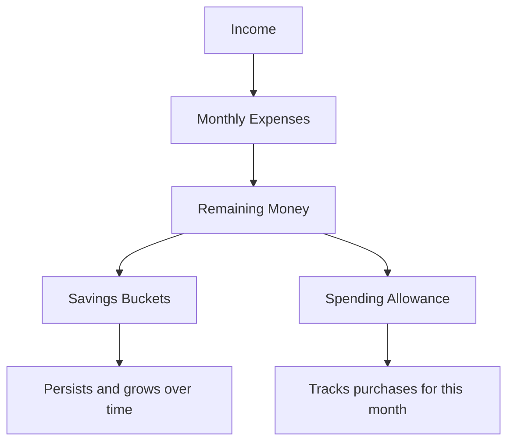
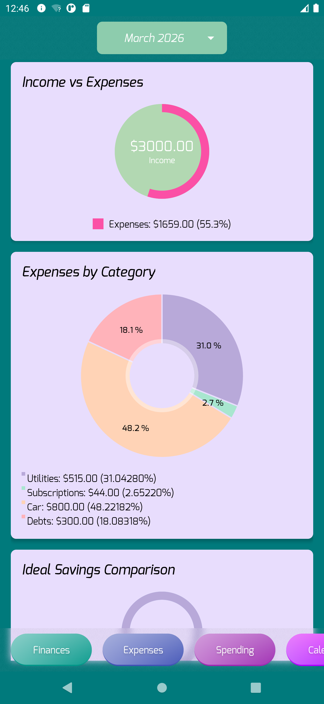
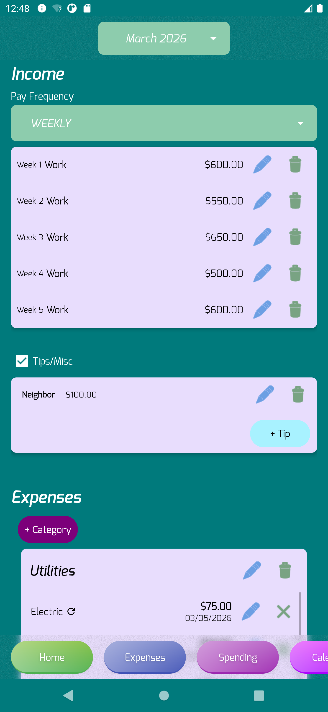
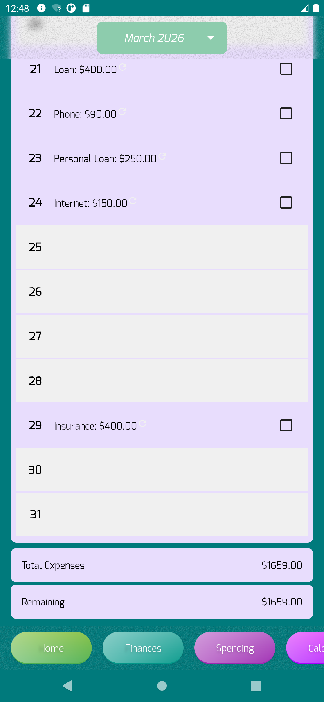
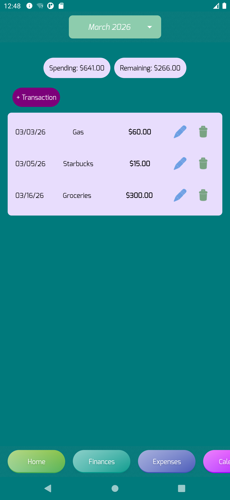
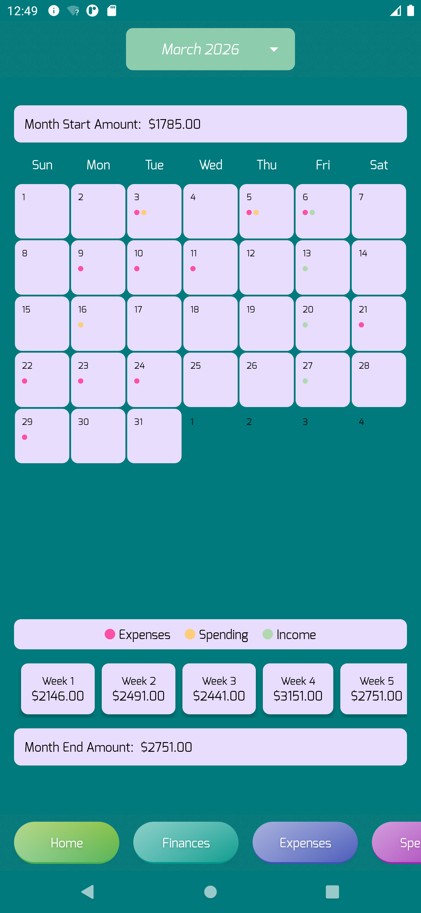
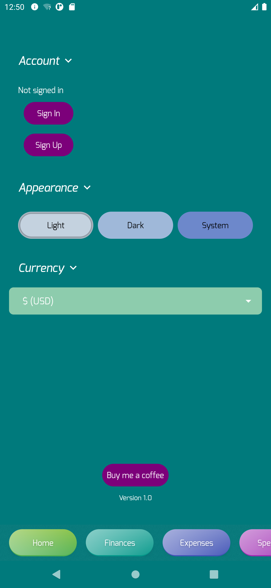
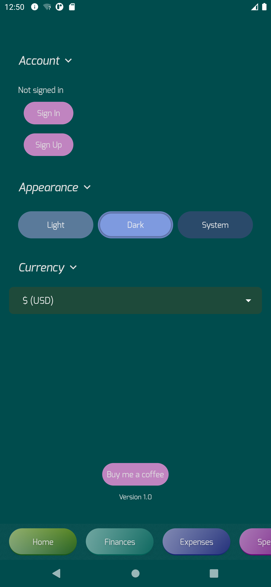
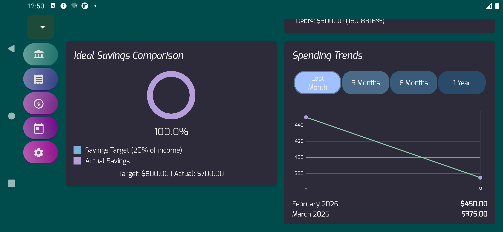

<!--suppress HtmlDeprecatedAttribute -->
<div align="center">


# Budget Brewer

### *Budget with intention. Spend with confidence. Without compromises.*

<br>

[](https://github.com/ataraxiagoddess/BudgetBrewer/releases)
[](LICENSE)


<br>


</div>

---

## Why Budget Brewer Exists

Most budgeting apps are designed around automation.

They encourage you to connect your bank account, automatically categorize your
transactions, subscribe to unlock essential features, and trust an algorithm to
understand your finances.

Budget Brewer was built on a different philosophy.

Budgeting is not something you should automate and forget. It is something you
should understand.

By intentionally planning your income, expenses, savings, and spending, you gain
something no algorithm can provide: awareness.

Budget Brewer does not try to replace your financial decisions. It helps you
make better ones.

Whether you are paying off debt, saving for a home, preparing for retirement, or
simply trying to understand where your paycheck goes each month, Budget Brewer
is designed to help you build confidence in your financial decisions.

It does so without advertisements, subscriptions, hidden costs, or unnecessary
complexity.

Because your money should work for you.

**Your budgeting app should too.**

---

## Philosophy

Budget Brewer is guided by a few simple principles.

- Intentional over automatic. Every penny should have a purpose.
- Privacy first. Your financial information belongs to you.
- Free forever. No subscriptions. No paywalls. No ads.
- You remain in control. Budget Brewer is a tool, not a financial advisor.
- Built for everyone. Accessibility, localization, and responsive design are
  fundamental, not optional.
- Crafted with care. Software should respect its users.

---

## What Budget Brewer Is

Budget Brewer is a hands-on, zero-dollar model budgeting app.

It helps you:

- record expected income;
- record recurring monthly expenses;
- see exactly how much money remains;
- allocate leftover money toward savings and spending;
- track spending through the month;
- grow dedicated savings buckets over time;
- review financial activity on charts and a calendar;
- export your data;
- optionally sync data through an account.

Budget Brewer is not:

- a subscription service;
- an advertisement platform;
- a budgeting app that monetizes your financial data;
- a replacement for your judgment;
- an app that requires bank linking;
- an algorithm deciding where your money belongs.

---

## How Budget Brewer Works


```mermaid
flowchart TD
    A[Income] --> B[Monthly Expenses]
    B --> C[Remaining Money]
    
    C --> D[Savings Buckets]
    C --> E[Spending Allowance]
    
    D --> F[Persists and grows over time]
    E --> G[Tracks purchases for this month]
```

Each month follows a straightforward workflow:

1. Record your expected income.
2. Record your recurring monthly expenses.
3. See exactly how much money remains.
4. Decide how much to allocate toward savings.
5. Decide how much to keep available for spending.
6. Track your spending throughout the month.

Your spending allowance resets each month as you create a new budget.

Your savings do not.

Savings buckets continue to grow month after month, helping you work toward
larger financial goals while still giving yourself permission to spend within
the limits you have chosen.

Budget Brewer is not about restricting your spending. It is about spending
intentionally.

---

## Features

### Monthly Budget Planning

Create a monthly budget by recording income, expenses (non-recurring and recurring), savings
allocations, and monthly spending allowance.

Everything is built around a zero-dollar budgeting philosophy where every penny
has a purpose.

### Savings Buckets

Create dedicated savings buckets for your financial goals.

Goal buckets track progress toward a target amount. Growth buckets allow money
to keep building without requiring a target.

Savings continue growing across months while staying separate from monthly
spending allowance.

### Spending Tracking

Record purchases as they happen and immediately see how they affect your
remaining spending allowance for the month.

Because expenses have already been planned, every purchase becomes a simpler
question:

*"Can I comfortably afford this today?"*

### Calendar Review

Review budgeting activity month by month with a calendar view that shows income,
expenses, spending, and savings activity.

### Visual Summaries

Understand your finances at a glance with Home dashboard visualizations for
income, expenses, savings, spending trends, and spending by tag.
<!--
The Home screen has received a focused accessibility and responsive layout pass,
including TalkBack summaries, heading semantics, chart alternatives, and
large-text behavior.
-->
### Optional Cloud Sync

Budget Brewer works without an account.

If you choose to create one, you can synchronize your data across devices and
restore it when setting up a new phone.

### Export Your Data

CSV and PDF export are currently available to users with an account.

Before release, Budget Brewer is planned to support local-only export and import
so users can back up or move their data without creating an account.

---

## Screenshots

The current screenshots live in `docs/images/`.


| Home                                                        | Finances                                                        |
|-------------------------------------------------------------|-----------------------------------------------------------------|
|  |  |

| Expenses                                                        | Spending                                                        |
|-----------------------------------------------------------------|-----------------------------------------------------------------|
|  |  |

| Calendar                                                        | Settings                                                        |
|-----------------------------------------------------------------|-----------------------------------------------------------------|
|  |  |

| Settings Dark                                                                 | Home Landscape Dark                                                                 |
|-------------------------------------------------------------------------------|-------------------------------------------------------------------------------------|
|  |  |

---

## Technology

Budget Brewer is a native Android application built with:

- Kotlin
- Android XML layouts
- ViewBinding
- Material Components for Android
- Room
- Supabase
- WorkManager
- MPAndroidChart
- Kizitonwose Calendar
- BlurView
- Timber

Current app configuration:

- minSdk: 24
- compileSdk: 37
- targetSdk: 37
- Java/Kotlin target: JVM 17
- Room schema version: 8


### Why Budget Brewer Uses XML Views

Budget Brewer uses Android's View system with XML layouts and ViewBinding.

The app relies heavily on mature View-based components, Android's resource
qualifier system, custom XML resources, and direct platform accessibility
behavior. Continuing with Views avoids introducing a hybrid UI stack or
rewriting responsive and TalkBack behavior that has already been carefully
tested across older phones, modern devices, foldables, and tablets.

Jetpack Compose is capable of building accessible and adaptive interfaces.
Budget Brewer remains with Views because they are the lower-risk and more
coherent fit for its current architecture—not because Compose is inherently
incapable.

See [Architecture](docs/ARCHITECTURE.md#why-budget-brewer-uses-xml-views) for the
full decision rationale.

---

## Architecture

Budget Brewer is built around MVVM, a central repository, local Room storage,
and offline-first synchronization.

The major architecture rules are:

- `BudgetRepository.kt` is the central data access layer.
- ViewModels expose screen state and one-time UI events using the existing local
  patterns.
- Room is the local source of truth.
- Supabase sync happens through `SyncManager`.
- Failed sync operations are queued in `pending_sync` and retried by
  `SyncWorker`.
- Navigation is programmatic through `NavDestination`, `BaseActivity`, and
  `NavigationManager`.
- UI is XML and ViewBinding, not Compose.
- Dependency injection is manual through ViewModel factories.

More detail is in [Architecture](docs/ARCHITECTURE.md).

---

## Accessibility And Responsive Design

Accessibility, localization, and responsive behavior are core parts of the app.

Budget Brewer is reviewed across:

- compact phones;
- large phones;
- tablets;
- portrait and landscape;
- normal and large text;
- increased display size;
- TalkBack;
- longer translated labels.

The Home screen is the current reference implementation for this standard. It
now includes grouped TalkBack announcements, heading semantics, chart
alternatives, touch-exploration layout behavior, scroll preservation during
dashboard reflow, and responsive timeframe controls.

More detail is in:

- [Accessibility](docs/ACCESSIBILITY.md)
- [Responsive Strategy](docs/RESPONSIVE_STRATEGY.md)
- [Design System](docs/DESIGN_SYSTEM.md)
- [Testing](docs/TESTING.md)
- [Screen Reviews](docs/SCREEN_REVIEWS.md)

---

## Documentation

Documentation is maintained alongside the project.

Current documents:

- [User Guide](docs/USER_GUIDE.md)
- [Architecture](docs/ARCHITECTURE.md)
- [Design System](docs/DESIGN_SYSTEM.md)
- [Responsive Strategy](docs/RESPONSIVE_STRATEGY.md)
- [Accessibility](docs/ACCESSIBILITY.md)
- [Testing](docs/TESTING.md)
- [Screen Reviews](docs/SCREEN_REVIEWS.md)
- [Contributing](CONTRIBUTING.md)
- [Changelog](CHANGELOG.md)
- [Templates](docs/TEMPLATES.md)
- [AI Agent Directives](AGENTS.md)

The old full project outline has been split into focused docs so each file has a
clear job and does not have to duplicate everything else.

---

## Installation

The easiest way to install Budget Brewer is to download the latest APK from the
[Releases page](https://github.com/ataraxiagoddess/BudgetBrewer/releases).

1. Open the Releases page.
2. Download the latest APK.
3. Enable installation from unknown sources if prompted.
4. Install Budget Brewer.

Budget Brewer is currently distributed through GitHub Releases. Additional
distribution platforms may be added in the future.

---

## Building From Source

Clone the repository:

```bash
git clone https://github.com/ataraxiagoddess/BudgetBrewer.git
```

Open the project in Android Studio and build normally, or run:

```bash
./gradlew assembleDebug
```

---

## Project Status

Budget Brewer is preparing for its first public production release.

The current focus is refining the app before wider release:

- responsive layouts;
- design system consistency;
- accessibility improvements;
- localization review;
- UI polish;
- documentation;
- performance review;
- final testing and quality assurance.

The goal is simple:

**Release a budgeting application that feels thoughtful, polished, and
trustworthy from day one.**

---

## Contributing

Contributions of all sizes are welcome.

Whether you have found a bug, have an idea for an improvement, notice a typo, or
would like to contribute code, your help is appreciated.

Please keep contributions focused, well documented, and consistent with the
project's design principles.

See [Contributing](CONTRIBUTING.md) for the working style used in this repo.

---

## Supporting The Project

Budget Brewer is, and always will be:

- free;
- open source;
- ad-free;
- subscription-free.

If Budget Brewer has helped you organize your finances and you would like to
support continued development, you can do so through Ko-fi.

<p align="center">
  <a href="https://ko-fi.com/I2I41VFS1R">
    
  </a>
</p>

---

## License

Budget Brewer is released under the MIT License.

See the [LICENSE](LICENSE) file for details.

---

## Acknowledgements

Budget Brewer exists because of the open-source community.

Special thanks to:

- Google and the Android development team
- JetBrains for Kotlin
- Material Design
- MPAndroidChart
- Supabase
- Kizitonwose Calendar
- Timber
- Everyone who tests, reports bugs, contributes ideas, or uses Budget Brewer

---

<div align="center">

## Budget with intention.

### Spend with confidence.

**Without compromises.**

</div>